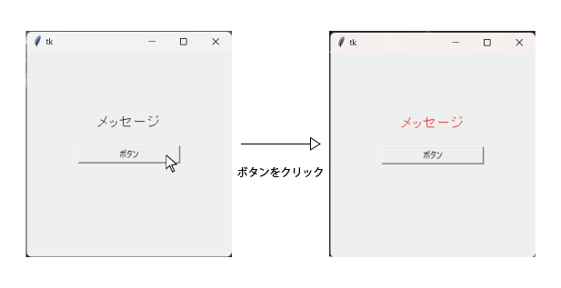
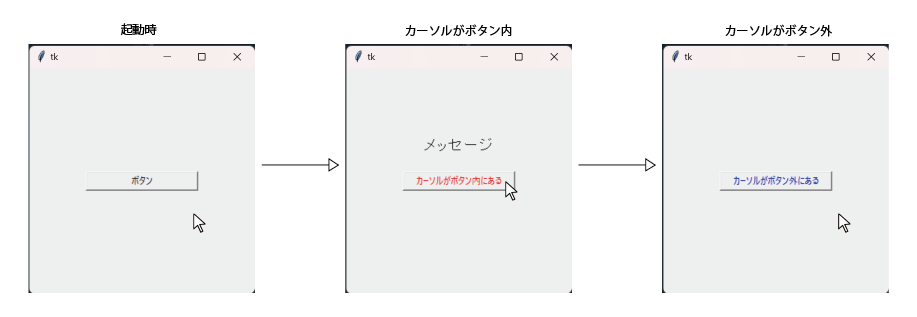

# Configについて
config()を使用することで、ウィンドウやウィジェットのオプション引数の値を変更することができます。
```python
# 1. tkinterをインポート
import tkinter as tk
# 2. 関数を定義
def click():
  label.config(fg="red")
# 3. 画面の作成
root=tk.Tk()
# 4. 画面の大きさを指定
root.geometry("300x300")
# 5. ボタンを定義
btn=tk.Button(text="ボタン, width=20, cursor="hand2", command=click)
# 6. ボタンを配置
btn.place(x=150, y=150, anchor="c")
# 7. ラベルを定義
label = tk.Label(text="メッセージ", font=("System", 18))
# 8. ラベルを配置
label.place(x=150, y=100, anchor="c")
# 9. メインループ
root.mainloop()
```
以上のプログラムを実行すると、ボタンのクリックで、テキストの色が変わることがわかります。
<div align="center">
  
</div>

**`プログラムの説明`**<br>
> 2. 関数clickはボタンがクリックされた際に、実行されます。ラベルのオプション引数の値を変更しています。<br>
ウィジェット.config(オプション引数の設定)で変更することができます。

# Bindについて
bind()を使用することで、イベントと関数の実行をつなげることができます。<br>
何かしら動作があった場合に、関数の実行を手助けします。（Buttonのcommandと似たようなものです。）

## bind　イベントの例

|イベント|説明|
|:-|:-|
|<1>, < Button-1 >, < ButtonPress >|左クリック|
|<2>, < Button-2 >|ホイールクリック|
|<3>, < Button-3 >|右クリック|
|< Double-1 >|ダブルクリック|
|< ButtonRelease >|クリックを離したとき|
|< x >, < KeyPress-X >|xキーを入力したとき|
|< Control-c >|Controlとcキーが押されたとき|
|< Enter >|マウスカーソルがウィジェット内に入ったとき|
|< Leave >|マウスカーソルがウィジェット内を出たとき|
|< Motion >|ウィジェット内でカーソルが動いたとき|

**bindの使用例**
```python
# 1. tkinterをインポート
import tkinter as tk
# 2. 関数を定義
def btn_in(self):
  btn.config(text="カーソルがボタン内にある", fg="red")
  label.place(x=150, y=100, anchor="c")
# 3. 関数を定義
def btn_out(self):
  btn.config(text="カーソルがボタン外にある", fg="blue")
  label.palace_forget()
# 4. 画面の作成
root=tk.Tk()
# 5. 画面の大きさを指定
root.geometry("300x300")
# 6. ボタンを定義
btn=tk.Button(text="ボタン, width=20, cursor="hand2")
# 7. ボタンを配置
btn.place(x=150, y=150, anchor="c")
# 8. ラベルを定義
label = tk.Label(text="メッセージ", font=("System", 18))
# 9.イベントと関数をつなげる（カーソルがボタン内に入った）
btn.bind("<Enter>", btn_in)
# 10.イベントと関数をつなげる（カーソルがボタン内を出た）
btn.bind("<Leave>", btn_out)
# 11. メインループ
root.mainloop()
```
<div align="center">
  
</div>

**`プログラムの説明`**<br>
> 2. 関数btn_inは、カーソルがボタン内に入った際に、実行されます。<br>
configを使用し、ボタンのオプション引数の値を変更しています。また、ラベルを配置しています。

> 4. 関数btn_outは、カーソルがボタン内を出た際に、実行されます。<br>
configを使用し、ボタンのオプション引数の値を変更しています。また、ラベルを取り除いています。

> 9. bind（"イベント", 関数名）を使用して、イベントと関数をつなげています。<br>
イベント<Enter>は、マウスカーソルがウィジェット内に入った時を意味しています。

> 10. bind（"イベント", 関数名）を使用して、イベントと関数をつなげています。<br>
イベント<Leave>は、マウスカーソルがウィジェット内を出た時を意味しています。

