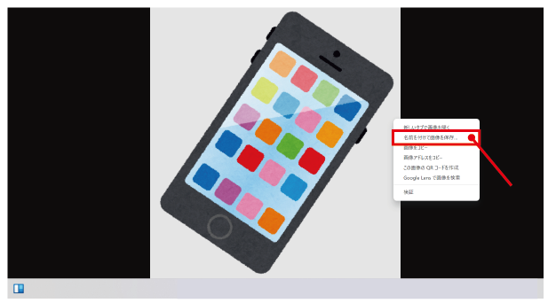
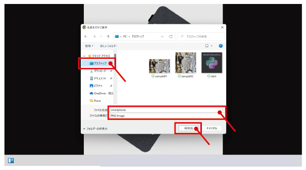
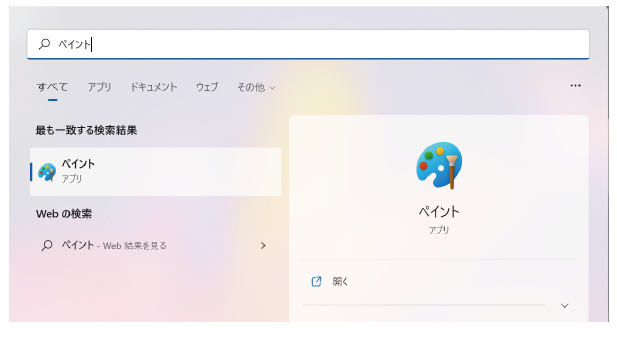
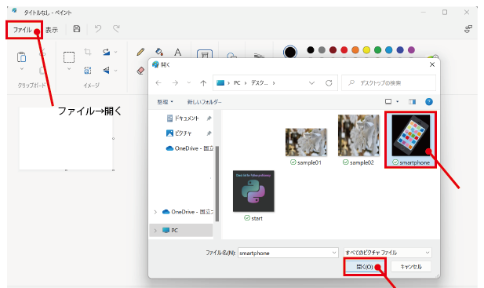
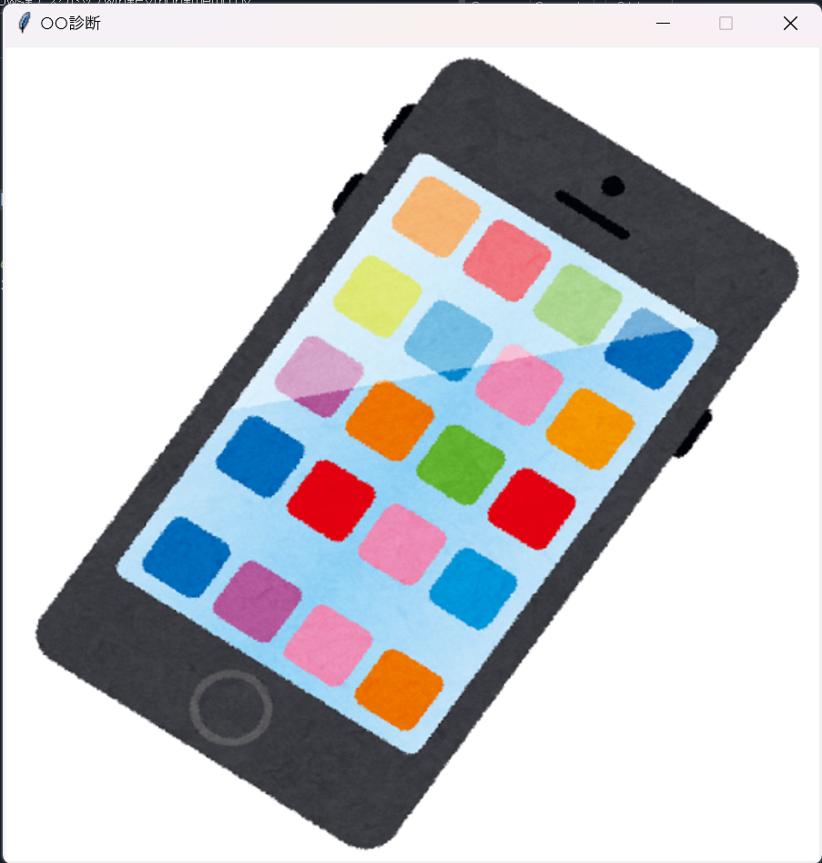

# 画像の準備
まずは、自分が使用したい画像を準備しましょう。<br>
インターネットでダウンロードしたり、自分で作成したりしましょう。<br>
今回はインターネットからダウンロードしてアプリに反映するまでの流れを紹介します。<br>
<br>
`手順1` インターネットから画像をタブレットに保存する<br><br>
「名前を付けて画像を保存」を選択します。<br>
<div align="center">
  
</div>
<br>
「画像の保存場所」を指定し、「ファイル名」を決め、「ファイルの種類」をPNGImageに設定して、保存しましょう。
<div align="center">
  
</div>
<br>

`注意点`<br>
画像を保存する場所は、pythonのコードと同じディレクトリに置くと便利です。<br><br>

`手順2` 画像をサイズを調整する（編集）<br><br>
ペイントアプリを使用します。Windowsアプリから、ペイントアプリを検索してみましょう。<br>
<div align="center">
  
</div>
<br>
ペイントアプリが起動できたら、「ファイル→開く」から、保存した画像を開きましょう。<br><br>
<div align="center">
  
</div>
<br>
「サイズの変更」をクリックし、サイズを調整していきましょう。<br>
ピクセルを選択し、水平と垂直の値をアプリのウィンドウサイズに設定します。（今回は600×600に設定）<br>
最後に、「OK」をクリックし、保存します。<br>
<br>

`注意点`<br>
固定をはずして、値の設定を行いましょう。<br>
<div align="center">
  
</div>
<br>

# コードの確認と編集

今回は、[3-3. キャンバスに画像を配置するまでの流れ](https://github.com/UC-k/R5_Toyama_STEAM/tree/main#3-3-%E3%82%AD%E3%83%A3%E3%83%B3%E3%83%90%E3%82%B9%E3%81%AB%E7%94%BB%E5%83%8F%E3%82%92%E9%85%8D%E7%BD%AE%E3%81%99%E3%82%8B%E3%81%BE%E3%81%A7%E3%81%AE%E6%B5%81%E3%82%8C)
のコードを応用していきます。（ウィンドウとキャンバスのサイズを600×600に変更してあります。）
```python
# 1. tkinterをインポート
import tkinter as tk
# 2. 画面の作成
root = tk.Tk()
# 3. タイトルを作成
root.title("○○診断")
# 4. 画面の大きさを指定
root.geometry("600x600")
# 5. 画面を拡大・縮小できないように設定
root.resizable(False, False)
# ----------------------------------------
# 6. キャンバスを定義
cvs = tk.Canvas(root, width=600, height=600)
# 7. キャンバスを配置
cvs.pack()
# ----------------------------------------
# 8. 使用する画像を定義
img = tk.PhotoImage(file="./smartphone.png")
# 9. 画像をキャンバスに配置
cvs.create_image(0, 0, anchor="nw", image=img, tag="start_image")
# ----------------------------------------
# 10. メインループ
root.mainloop()
```
以上のプログラムを実行すると、スタート画面の画像が、保存した画像に変更されます。<br>
画像が反映されているか確認してみましょう。
<div align="center">
  
</div>

`プログラムの変更箇所`<br>
8. 使用する画像を定義において、「file="./mdimg/image.png"」から「file="./smartphone.png"」に変更しました。<br>
ここでは、先ほど準備した画像を読み込むために、保存した場所（階層）とファイル名を指定しています。

`よくあるエラー文`

```python
TelError: could't open "./xxxxxx.png": no such file or directory
```
このエラー文が出た場合、指定した画像のファイルが見つからず、階層が間違っていることを意味しています。<br>
一度、保存した画像のファイルと、診断アプリのpythonのファイルの保存場所が同じ階層にあるか確かめてみましょう。


