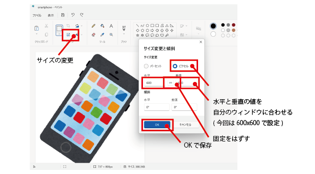

# 画像の準備
まずは、自分が使用したい画像を準備しましょう。 
インターネットでダウンロードしたり、自分で作成したりしましょう。 
今回はインターネットからダウンロードしてアプリに反映するまでの流れを紹介します。 
 
`手順1` インターネットから画像をタブレットに保存する 
「名前を付けて画像を保存」を選択します。 

  

 
「画像の保存場所」を指定し、「ファイル名」を決め、「ファイルの種類」をPNGImageに設定して、保存しましょう

  

 

`注意点` 
画像を保存する場所は、pythonのコードと同じディレクトリに置くと便利です。 

`手順2` 画像をサイズを調整する（編集） 
ペイントアプリを使用します。Windowsアプリから、ペイントアプリを検索してみましょう。 

  

 
ペイントアプリが起動できたら、「ファイル→開く」から、保存した画像を開きましょう。  

  

 
「サイズの変更」をクリックし、サイズを調整していきましょう。 
ピクセルを選択し、水平と垂直の値を設定します。（今回は600×600に設定） 
最後に、「OK」をクリックし、保存します。 
 

`注意点` 
固定をはずして、値の設定を行いましょう。 

  

 

# コードの確認
