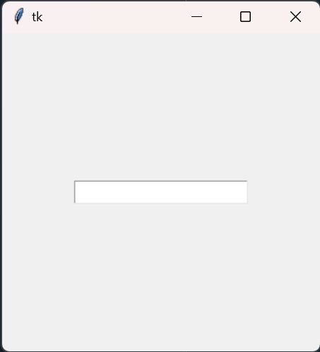
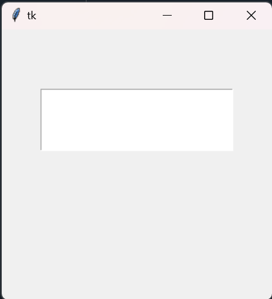

# テキストの入力
tkinterにおいて、ユーザがテキスト入力を行うことができるテキスト入力欄のオブジェクトを作成する際、「Entry」という1行の入力欄、または「Text」という複数行の入力欄がある。

# １行のテキスト入力欄について（Entry）
tkinter.Entryを使用して、１行のテキスト入力欄を作成してみましょう。
```python
# 1. tkinterをインポート
import tkinter as tk
# 2. 画面の作成
root = tk.Tk()
# 3. 画面の大きさを指定
root.geometry("300x300")
# 4. エントリー（テキストボックス）を定義
entry = tk.Entry(fg="grey", bg="white", font="System", width=20)
# 5. エントリー（テキストボックス）を配置
entry.place(x=150, y=150, anchor="c")
# 6. メインループ
root.mainloop()
```
<div align="center>

</div>

`プログラムの説明`<br>
4. Entry(fg="文字色", bg="背景色", font="フォント", width="半角文字数分の横幅")で定義します。<br>
5. place(x="半角文字数", y="半角文字数", anchor="c")で配置します。<br>


# 複数行のテキスト入力欄について（Text）
tkinter.Textを使用して、複数行のテキスト入力欄を作成してみましょう。
```python
# 1. tkinterをインポート
import tkinter as tk
# 2. 画面の作成
root = tk.Tk()
# 3. 画面の大きさを指定
root.geometry("300x300")
# 4. テキスト（テキストボックス）を定義
txt = tk.Text(width=30, height=5)
# 5. テキスト（テキストボックス）を配置
txt.place(x=150, y=100, anchor="c")
# 6. メインループ
root.mainloop()
```
<div align="center>

</div>

`プログラムの説明`<br>
4. Text(width=半角文字数, height=半角文字数)で定義します。widthは1行における文字数、heightは行数を指定します。<br>
5. place(x="半角文字数", y="半角文字数", anchor="c")で配置します。<br>


# テキストの一部の色を変更する
0-0. ではtkinterにおいて、tkinter.Labelを用いてテキストを配置しました。<br>
しかし、Labelでは、テキストの一部のみ色を変更することはできません。（テキスト全体はできる。）<br>
そこで、テキストの一部のみ色を変更したい場合は、EntryまたはTextを使用します。<br>
.tag_configure()を使用して、自分の好きな色に指定してみましょう。
```python
import tkinter as tk
```
`プログラムの説明`<br>
1. <br>
2. <br>

`解説`<br>
1. .insert("1.0","〇〇〇〇")テキスト<br>
2. <br>
