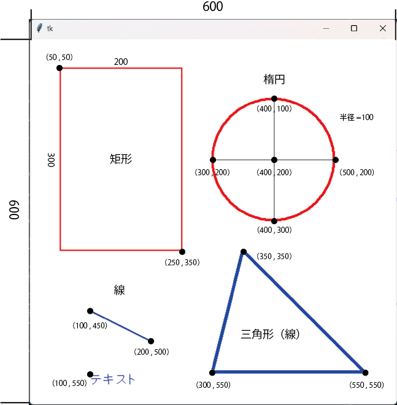
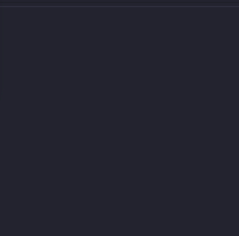
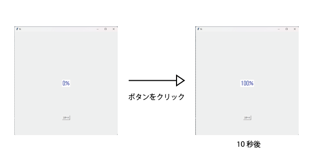
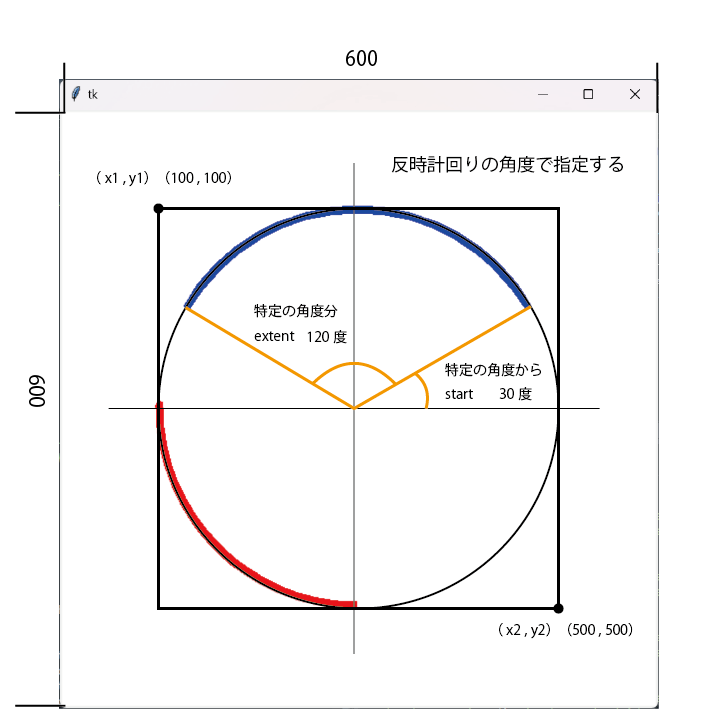

# キャンバスに図形を描く
今回は[3. キャンバスの作成と画像の配置](https://github.com/UC-k/R5_Toyama_STEAM/tree/main#3-%E3%82%AD%E3%83%A3%E3%83%B3%E3%83%90%E3%82%B9%E3%81%AE%E4%BD%9C%E6%88%90%E3%81%A8%E7%94%BB%E5%83%8F%E3%81%AE%E9%85%8D%E7%BD%AE)
を応用して、キャンバスに図形を配置していきます。<br>
まずは、キャンバスについて振り返ってみましょう。<br>

*以下のプログラムはこのコードのみでは動作しません。*
``` python
# 1. キャンバスを定義
cvs = tk.Canvas(root, width=900, height=700)
# 2. キャンバスを配置
cvs.pack()
# 3. 使用する画像を定義
img = tk.PhotoImage(file="./image.png")
# 4 .画像をキャンバスに配置
cvs.create_image(0, 0, anchor="nw", image=img, tag="start_image")
```
以上のように、キャンバスはCanvas()で定義し、pack()で配置することができました。<br>
また、キャンバス上には、create_img()で画像を配置することができました。<br>
**同様にして、キャンバス上には、create_xxxで図形を配置することができます。**

<br>

## キャンバスの図形描画の例
**表**
|図形|メソッド|
|:-|:-|
|矩形|create_rectangle|
|楕円|create_oval|
|線|create_line|
|円弧|create_arc|
|画像|create_image|
|テキスト|create_text|

<br>

**コード**
```python
# 1. tkinterをインポート
import tkinter as tk
# 2. 画面の作成
root = tk.Tk()
# 3. キャンバスを定義
cvs = tk.Canvas(root, width=600, height=600, bg="white")
# 4. キャンバスを配置
cvs.pack()
# 5. 矩形をキャンバスに配置
cvs.create_rectangle(50, 50, 250, 350, fill="white", outline="red", width=2)
# 6. 楕円をキャンバスに配置
cvs.create_oval(300, 100, 500, 300, fill="white", outline="red", width=4)
# 7. 線をキャンバスに配置
cvs.create_line(100, 450, 200, 500, fill="blue", width=2)
# 8. 三角形（線）をキャンバスに配置
cvs.create_line(350, 350, 550, 550, 300, 550, 350, 350, fill="blue", width=5)
# 9. テキストを配置
cvs.create_text(100, 550, text="テキスト", fill="blue",font=("System", 20), anchor="nw")
# 10. メインループ
root.mainloop()
```

<br>

<div align="center">
    
</div>

<br>

**`プログラムの説明`**
> 5. 矩形のオブション引数は、 create_rectangle（x, y, x+width, y+height, 内側の色, 外線の色, 線幅）となる。<br>
今回は、create_rectangle(50, 50, 50+200, 50+300, 内側=白, 外側=赤, 幅=2)である。

> 6. 楕円のオプション引数は、　楕円（中心(x)-半径(r), 中心(y)-半径(r), x+r, y+r, 内側の色, 外側の色, 線幅）となる。<br>
今回は、create_oval(400(中心x)-100(半径r), 200(中心y)-100(半径r), 400+100, 200+100, 内側=白, 外側=赤, 幅=4)である。

> 7. 線のオプション引数は、　線（x1, y1, x2, y2, color, 線幅）となる。<br>
今回は、create_line(100, 450, 200, 500, 色=青, 幅=2)である。

> 8. 三角形（線）のオプション引数は、　三角形（x1, y1, x2, y2, x3, y3, x1, y1, color, 線幅）となる。三角形は、線を3本描くことで、表現している。<br>
今回は、create_line(350, 350, 550, 550, 300, 550, 350, 350, 色=青, 幅=5)である。

> 9. テキストのオプション引数は、　テキスト（x, y, text, color, font, anchor）となる。<br>

<br>

---

<br>

# ロード画面(デモ)

<div align="center">
    
</div>

# Afterについて

after()を使用することで、　指定時間ごと（定期的）に関数（処理）を実行することがきます。

```python
# 1. tkinterをインポート
import tkinter as tk
# 2. 変数を定義
load = 0
# 3. 関数を定義
def repeat():
    global load
    # 4. もし変数が１００より小さいならば
    if load < 100:
        # 5. 変数に１を加算
        load += 1
        # 6. 0.1秒後に関数「repeat」を実行
        root.after(100,repeat)
    # 7. もし変数が１００より大きいならば
    elif load > 100:
        # 8. 変数を１００に定義
        load = 100
    # 9. テキストのオプション変数を変更
    load_text.config(text=str(load)+"%)
# 10. 画面の生成
root = tk.Tk()
# 11. 画面の大きさを指定
root.geometry("600x600")
# 12. ラベル（テキスト）を定義
load_text = tk.Label(text="0%", font=("System", 30), fg="blue", bg="white").
# 13. ラベル（テキスト）を配置
load_text.place(x=300, y=500, anchor="c")
# 14. ボタンを定義
button = tk.Button(text="スタート", command=repeat)
# 15. ボタンを配置
button.place(x=300,y=500,anchor="c")
# 16. メインループ
root.mainloop()
```
以上のプログラムを実行すると、ボタンのクリックで、テキストが0％から100％まで変化（1秒あたり10%）することがわかります。

<div align="center">
    
</div>

**`プログラムの説明`**
> 2. この変数が〇〇％の値を意味しています。<br>

> 6. after(xx ms,関数名) は、xx ms経過後に関数を実行します。<br>
今回は、100msつまり0.1秒後に関数「after」を実行しているということです。<br>
（参考）　100ms : 0.1秒 , 1000ms : 1秒 , 5000ms : 5秒<br>

> 9. config()を使用して、テキストを変更しています。<br>
config()について分からない場合は[こちら](../Event)をみてみましょう。

<br>

# キャンバスの図形描画(円弧)について
上記にある、キャンバスの図形描画の例に戻りましょう。<br>
円弧は、create_arcを使用して描画できます。扇形の図形を描くイメージです。

```
create_arc(x1, y1, x2, y2, style, outline, start, extent, 横幅)　で定義します。
```

**コード**

```python
# 1. tkinterをインポート
import tkinter as tk
# 2. 画面の作成
root = tk.Tk()
# 3. キャンバスを定義
cvs = tk.Canvas(root, width=600, height=600, bg="white")
# 4. キャンバスを配置
cvs.pack()
# 5. 円弧をキャンバスに配置
cvs.create_arc(100, 100, 500, 500, style=tk.ARC, outline="blue",
                    start=30, extent=120, width=8)
# 6. 円弧をキャンバスに配置
cvs.create_arc(100, 100, 500, 500, style=tk.ARC, outline="red",
                    start=180, extent=90, width=8)
# 7. メインループ
root.mainloop()
```

<div align="center">
    
</div>

<br>

**`プログラムの説明`**
> 5. 円弧のオブション引数は、 create_rectangle（x1, y1, x2, y2, style, outline, start, extent, 横幅）となる。<br>
今回は、create_rectangle(100, 100, 500, 500, style=円弧, 色=青, 始めの位置=30度, 描く範囲=120度, 幅=8)である。<br>
座標 (x1, y1) を左上、座標 (x2, y2) を右下とした矩形の中に楕円が描画されるイメージです。<br>

> 6. 円弧のオブション引数は、 create_rectangle（x1, y1, x2, y2, style, outline, start, extent, 横幅）となる。<br>
今回は、create_rectangle(100, 100, 500, 500, style=円弧, 色=赤, 始めの位置=180度, 描く範囲=90度, 幅=8)である。<br>

**`注意点`**
- **描く範囲は、反時計回りに角度で指定します。**

<br>

# ロード画面を作成する
では、afterと円弧を組み合わせてロード画面を作成していきましょう。

```python
# 1. tkinterをインポート
import tkinter as tk
# 2. mathをインポート
import math
# 3. 変数を定義
bar1 = 0
# 4. 変数を定義
bar2 = 0
# 5. 変数を定義
load = 0
# ------------------------------------------------------------------------------
# 6. 関数を定義 
def start():
    global bar1, bar2, load
    # 中心にパーセントを表示
    # 7. もし変数が１００より小さいならば
    if load < 100:
        # 8. 変数に1.38を加算
        load += 1.38
    # 9. もし変数が１００より大きいならば
    elif load > 100:
        # 10. 変数を１００に定義
        load = 100
    # 10. テキストのオプション変数を変更
    load_txt.config(text=str(math.floor(load))+"%")
    # ロード中のサークル描画
    # 11. 円弧をキャンバスに配置
    cvs.create_arc(100, 100, 500, 500, width=8, style=tk.ARC, outline="#01FACA",
            start=90, extent=bar1)
    # 12. 円弧をキャンバスに配置
    cvs.create_arc(100, 100, 500, 500, width=8, style=tk.ARC, outline="#01FACA",
            start=270, extent=bar2)
    # 13. キャンバスに描画されない場合の対処
    cvs.update()
    # 円を徐々に描写するために変数を変化させる
    # 14. もし変数が-180以上ならば
    if bar2 >= -180:
        # 15. もし変数が-180以上ならば
        if bar1 >= -180:
            # 16. 変数に5を減算
            bar1 -= 5
        # 17. もし変数が-180より小さいならば
        elif bar1 < -180:
            # 18. 変数に５を減算
            bar2 -= 5
        # 18. 0.001秒後に関数「start」を実行
        root.after(1, start)
# ------------------------------------------------------------------------------
# 19. 画面の作成
root = tk.Tk()
# 20. 画面の大きさを指定
root.geometry("600x600")
# 21. 画面を固定
root.resizable(False, False)
# ------------------------------------------------------------------------------
# 22. キャンバスを定義
cvs = tk.Canvas(root, width=600, height=600, bg="#323232")
# 23. キャンバスを配置
cvs.pack()
# ------------------------------------------------------------------------------
# 24. ラベル（テキスト）を定義
load_txt = tk.Label(text="0%", font=("DSEG7 Classic", 30),
                    fg="#01FACA", bg="#323232")
# 25. ラベル（テキスト）を配置
load_txt.place(x=300, y=300, anchor="c")
# 26. 関数「start」を実行
start()
# 27. メインループ
root.mainloop()
```

