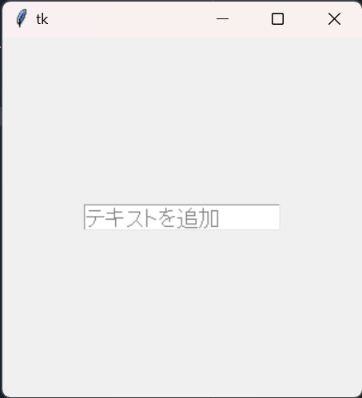
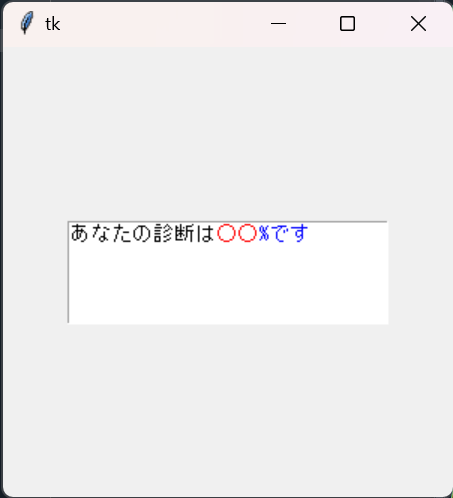
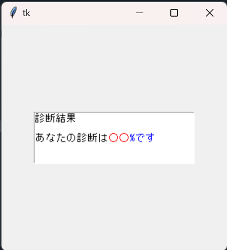
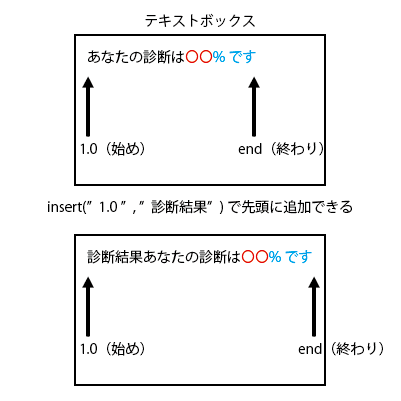

# テキストの入力
tkinterにおいて、ユーザがテキスト入力を行うことができるテキスト入力欄のオブジェクトを作成する際、「Entry」という1行の入力欄、または「Text」という複数行の入力欄がある。

# １行のテキスト入力欄について（Entry）
tkinter.Entryを使用して、１行のテキスト入力欄を作成してみましょう。
```python
# 1. tkinterをインポート
import tkinter as tk
# 2. 画面の作成
root = tk.Tk()
# 3. 画面の大きさを指定
root.geometry("300x300")
# 4. エントリー（テキストボックス）を定義
entry = tk.Entry(fg="grey", bg="white", font="System", width=20)
# 5. エントリー（テキストボックス）を配置
entry.place(x=150, y=150, anchor="c")
# 6. メインループ
root.mainloop()
```
以上のプログラムを実行すると、画面上に1行のテキストボックスが作成されます。<br>
テキストを入力できるので試してみてください。
<br>
<div align="center">

</div>

`プログラムの説明`<br>
4. Entry(fg="文字色", bg="背景色", font="フォント", width="半角文字数分の横幅")で定義します。<br>
5. place(x="半角文字数", y="半角文字数", anchor="c")で配置します。<br>


# 複数行のテキスト入力欄について（Text）
tkinter.Textを使用して、複数行のテキスト入力欄を作成してみましょう。
```python
# 1. tkinterをインポート
import tkinter as tk
# 2. 画面の作成
root = tk.Tk()
# 3. 画面の大きさを指定
root.geometry("300x300")
# 4. テキスト（テキストボックス）を定義
txt = tk.Text(width=30, height=5)
# 5. テキスト（テキストボックス）を配置
txt.place(x=150, y=100, anchor="c")
# 6. メインループ
root.mainloop()
```
以上のプログラムを実行すると、画面上に複数行のテキストボックスが作成されます。<br>
テキストを入力できるので試してみてください。
<br>
<div align="center">

</div>

`プログラムの説明`<br>
4. Text(width=半角文字数, height=半角文字数)で定義します。widthは1行における文字数、heightは行数を指定します。<br>
5. place(x="半角文字数", y="半角文字数", anchor="c")で配置します。<br>

# テキスト入力欄にテキストを追加する
「4. 画面にテキストを入れる」ではtkinterにおいて、tkinter.Labelを用いてテキストを配置しました。<br>
その際、Label(text="ラベルテキスト")のようにラベルを定義し、テキストを表現しました。<br>
今回は、EntryまたはTextを使用したテキストの表現方法を紹介します。
```python
# 1. tkinterをインポート
import tkinter as tk
# 2. 画面の作成
root = tk.Tk()
# 3. 画面の大きさを指定
root.geometry("300x300")
# 4. エントリー（テキストボックス）を定義
entry = tk.Entry(fg="grey", bg="white", font="System", width=20)
# 5. エントリー（テキストボックス）を配置
entry.place(x=150, y=150, anchor="c")
# 6. エントリー（テキストボックス）にテキストを追加
entry.insert("end", "テキストを追加")
# 7. メインループ
root.mainloop()
```
以上のプログラムを実行すると、画面上に「テキストを追加」と入力されたテキストボックスが作成されます。<br>
このようにLabelと異なる方法でテキストを表現することができます。
<div align="center">

</div>

`プログラムの説明`<br>
6. insert("end","テキスト")でテキストボックスにテキストを追加することができます。

# テキストの一部の色を変更する
「4. 画面にテキストを入れる」ではtkinterにおいて、tkinter.Labelを用いてテキストを配置しました。<br>
しかし、Labelでは、テキストの一部のみ色を変更することはできません。（テキスト全体はできる。）<br>
そこで、テキストの一部のみ色を変更したい場合は、EntryまたはTextを使用します。<br>
.tag_configure()を使用して、自分の好きな色に指定してみましょう。
```python
# 1. tkinterをインポート
import tkinter as tk
# 2. 画面の作成
root = tk.Tk()
# 3. 画面の大きさを指定
root.geometry("300x300")
# 4. テキスト（テキストボックス）を定義
txt = tk.Text(width=30, height=5)
# 5. テキスト（テキストボックス）を配置
txt.place(x=150, y=100, anchor="c")
# 6. 色を変更するために３色を準備
txt.tag_configure("black", foreground="black")#黒
txt.tag_configure("red", foreground="#FF0000")#赤
txt.tag_configure("blue", foreground="#0000FF")#青
# 7. テキスト（テキストボックス）に順に色を指定してテキストを追加
txt.insert("end", "あなたの診断は", "black")
txt.insert("end", "〇〇", "red")
txt.insert("end", "%です", "blue")
# 8. メインループ
root.mainloop()
```
以上のプログラムを実行すると、画面上に「あなたの診断は〇〇%です」と入力されたテキストボックスが作成されます。<br>
このように一部の色を変更したい場合は、テキストを小分けに追加していき、タグで色を選択します。
<div align="center">

</div>

`プログラムの説明`<br>
6. tag_configure("タグの名前", foreground="色を指定")でタグを準備します。<br>
あらかじめタグを準備することで、テキストを追加する際に、色を選択することができます。<br>
7. insert("end", "テキスト", "タグの名前")でテキストを追加します。<br>
タグの名前を引数に入れることで、選択した色のテキストが追加されます。<br>

# insert（）の解説
insert("end","〇〇〇〇")でテキストを追加してきました。<br>
第一引数の"end"を変更すると、テキストボックス内の指定の位置にテキストを追加することができます。<br>
１つ前のコードに追記して編集してみると
```python
省略
# 6. 色を変更するために３色を準備
txt.tag_configure("black", foreground="black")#黒
txt.tag_configure("red", foreground="#FF0000")#赤
txt.tag_configure("blue", foreground="#0000FF")#青
# 7. テキスト（テキストボックス）に順に色を指定してテキストを追加
txt.insert("end", "あなたの診断は", "black")
txt.insert("end", "〇〇", "red")
txt.insert("end", "%です", "blue")
txt.insert("1.0", "診断結果\n\n")#追加箇所
# 8. メインループ
root.mainloop()
```
以上のプログラムを実行すると、一つ前のコードに比べ、「診断結果」と1行目に追記されたテキストボックスが作成されます。<br>
<div align="center">

</div>

`プログラムの説明`<br>
7. insert("1.0","テキスト")でテキストボックスの先頭にテキストを追加できる。<br>
図で説明すると
<div align="center">

</div>

`補足`<br>
insert("1.0", "診断結果\n\n")の「\n」は改行を表しています。<br>
つまり、診断結果のテキストの後に、２回改行しているということです

