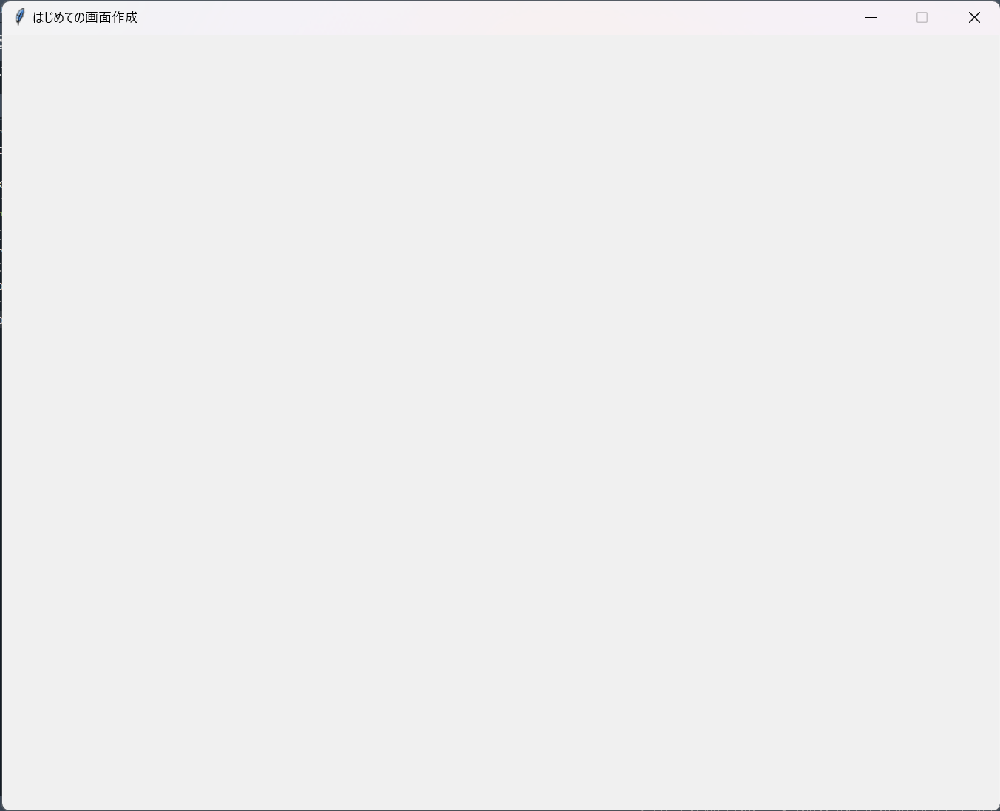

# R5_富山高校_総合的な探究の時間(STEAM活動)

<br>

- 富山高校の総合的な探究の時間で扱う演習教材です。基本的に順に沿って進めてください。
- わからない箇所があれば先生に質問してください。
- 扱う内容はPythonの`tkinter（画面生成）`、`for文（繰り返し）`、`if文（条件分岐）`、`リスト（配列）`、`線形探索`、`関数`です。
- 演習を通して診断アプリ（デスクトップアプリケーション）を作成します。
- 最終的に、個人でオリジナルの診断アプリを作成して提出・発表してもらいます。

<br>

## 0. コードの説明について
Githubでは、プログラムは以下ようなブロックに囲まれた画面になります。
``` python
# 1. 変数xに1を代入
x = 1
# 2. 変数yに2を代入
y = 2
# 3. xとyの加算を表示する
print(x + y)
```
プログラムの説明はコメントアウトで記していきます。<br>
また、コードを囲んだブロックの右上には、コピーができるアイコンが表示されます。<br>
必要に応じて自分でプログラムを書き写したり、コピーして貼り付けたりしましょう。

<br>

## 1. GUI

<br>

### 1-1. GUIとは
- **GUI**（Graphical User Interface）とは、コンピュータの画面上に表示されるウィンドウやアイコン、ボタン、プルダウンメニューなどを使い、マウスなどのポインティングデバイスで操作できるインターフェイスのことです。<br>
- 文字によるコマンド入力方式の**CUI**（Character User Interface）と比較して、GUIはより直感的にユーザが操作しやすいインターフェイスとなっています。

<br>

### 1-2. tkinterとは
- **tkinter**とは、Pythonでグラフィック関連（表示・操作）のソフトウェアを開発するためのライブラリです。<br>
- PythonでGUIを扱うためのライブラリはいくつか存在しますが、tkinterはPython標準ライブラリのため、比較的導入が容易であり、デスクトップアプリケーションの開発に向いています。

<br>

## 2. 画面の作成

<br>

tkinterを使用して、まずは画面を作成してみましょう。<br>
以下のコードを実行してください。
``` python
# 1. tkinterをインポート
import tkinter as tk
# 2. 画面の作成
root = tk.Tk()
# 3. タイトルを作成
root.title("はじめての画面作成")
# 4. 画面の大きさを指定
root.geometry("900x700")
# 5. 画面を拡大・縮小できないように設定
root.resizable(False, False)
# 6. メインループ
root.mainloop()
```

以上のプログラムを実行すると、画面上に新たなウィンドウが作成されます。<br>
もし画面上に出てきていないならば、プログラムが間違っているか、もしくは他のウィンドウで隠れている可能性があります。<br>


