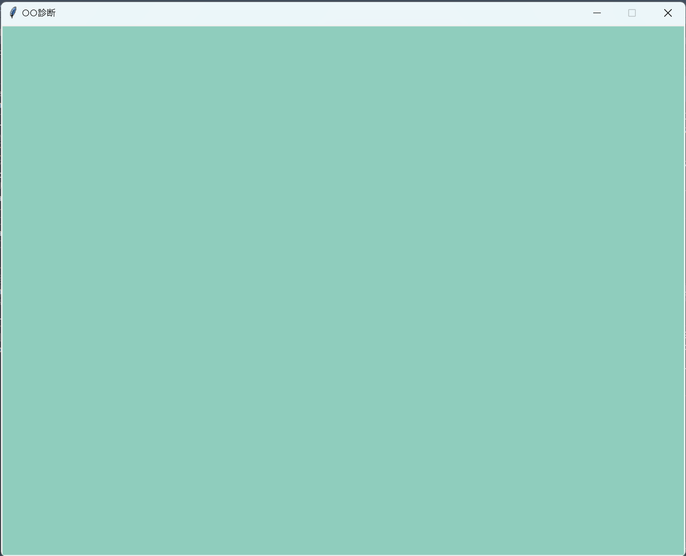
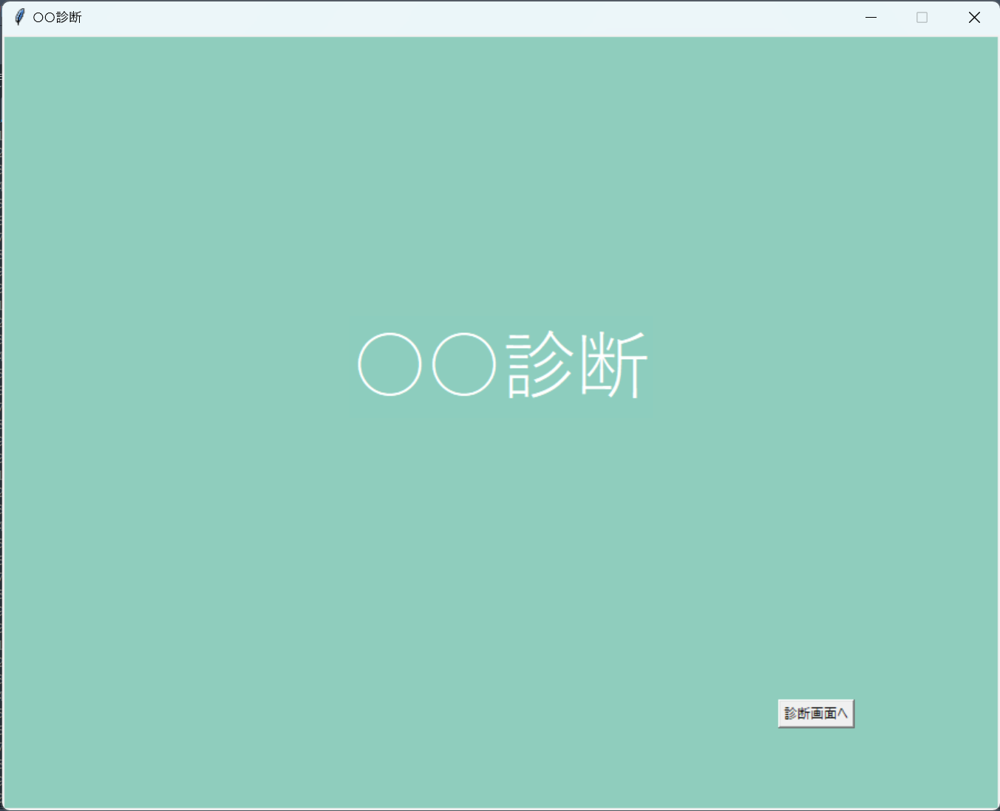
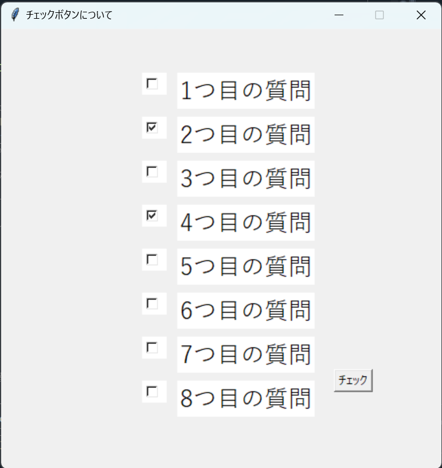

# R5_富山高校_総合的な探究の時間(STEAM活動)

<br>

- 富山高校の総合的な探究の時間で扱う演習教材です。基本的に順に沿って進めてください。
- わからない箇所があれば先生に質問してください。
- 扱う内容はPythonの`tkinter（画面生成）`、`for文（繰り返し）`、`if文（条件分岐）`、`リスト（配列）`、`線形探索`、`関数`です。
- 演習を通して診断アプリ（デスクトップアプリケーション）を作成します。
- 最終的に、個人でオリジナルの診断アプリを作成して提出・発表してもらいます。

<br>

## 発展編について
オリジナルの診断アプリ作成において、さらに発展したプログラムに挑戦したい方は以下のリンクを参考にしてください。<br>
[オリジナル診断アプリ_発展編](https://github.com/UC-k/R5_Toyama_STEAM/tree/main/NextStep)

<br>

## サンプルgif画像


<br>

## 目次

<details><summary>クリックで表示・非表示の切り替え</summary>

<br>

0. [コードの説明について](#0-コードの説明について)<br><br>
1. [GUI](#1-gui)<br>
   &emsp;1-1. [GUIとは](#1-1-guiとは)<br>
   &emsp;1-2. [tkinterとは](#1-2-tkinterとは)<br><br>
2. [画面の作成と設定](#2-画面の作成と設定)<br><br>
3. [キャンバスの作成と画像の配置](#3-キャンバスの作成と画像の配置)<br>
   &emsp;3-1. [キャンバスの作成](#3-1-キャンバスの作成)<br>
   &emsp;3-2. [キャンバスに画像を配置](#3-2-キャンバスに画像を配置)<br>
   &emsp;3-3. [キャンバスに画像を配置するまでの流れ](#3-3-キャンバスに画像を配置するまでの流れ)<br><br>
4. [画面にテキストを入れる](#4-画面にテキストを入れる)<br><br>
5. [ボタンと関数](#5-ボタンと関数)<br>
   &emsp;5-1. [ボタン](#5-1-ボタン)<br>
   &emsp;5-2. [関数](#5-2-関数)<br>
   &emsp;5-3. [ボタンを押したら関数が実行される仕組み](#5-3-ボタンを押したら関数が実行される仕組み)<br><br>
6. [チェックボタンとウィジェット変数](#6-チェックボタンとウィジェット変数)<br>
   &emsp;6-1. [チェックボタンを配置する](#6-1-チェックボタンを配置する)<br>
   &emsp;6-2. [複数個のチェックボタンを配置する](#6-2-複数個のチェックボタンを配置する)<br><br>
7. [診断画面を作成する](#7-診断画面を作成する)<br>
   &emsp;7-1. [チェックマークにチェックがついている数をかぞえる](#7-1-チェックマークにチェックがついている数をかぞえる)<br>
   &emsp;7-2. [チェックマークに合わせてテキストを表示する](#7-2-チェックマークに合わせてテキストを表示する)<br><br>
8. [結果画面を作成する](#8-結果画面を作成する)<br><br>
9. [診断アプリを作成する](#9-診断アプリを作成する)<br><br>
10. [オリジナルの診断アプリ作成に向けて](#10-オリジナルの診断アプリ作成に向けて)


</details>

<br>


## 0. コードの説明について
Githubでは、プログラムは以下ようなブロックに囲まれた画面になります。
``` python
# 1. 変数xに1を代入
x = 1
# 2. 変数yに2を代入
y = 2
# 3. xとyの加算を表示する
print(x + y)
```
- プログラムの説明はコメントアウトで記していきます。
- ブロック外にコメントアウトでの説明以外に、より詳しい説明内容の`プログラムの説明`を記していますが、最初から全て理解するのは困難です。
- そのため、最初はコメントアウトの説明を理解して「**このコードはこの処理をしているんだな**」とプログラムの流れを掴んでください。
- また、コードを囲んだブロックの右上には、コピーができるアイコンが表示されます。
- 必要に応じて自分でプログラムを書き写したり、コピーして貼り付けたりしましょう。

<br>

## 1. GUI

<br>

### 1-1. GUIとは
- **GUI**（Graphical User Interface）とは、コンピュータの画面上に表示されるウィンドウやアイコン、ボタン、プルダウンメニューなどを使い、マウスなどのポインティングデバイスで操作できるインターフェイスのことです。<br>
- 文字によるコマンド入力方式の**CUI**（Character User Interface）と比較して、GUIはより直感的にユーザが操作しやすいインターフェイスとなっています。

<br>

### 1-2. tkinterとは
- **tkinter**とは、Pythonでグラフィック関連（表示・操作）のソフトウェアを開発するためのライブラリです。<br>
- PythonでGUIを扱うためのライブラリはいくつか存在しますが、tkinterはPython標準ライブラリのため、比較的導入が容易であり、デスクトップアプリケーションの開発に向いています。

<br>

## 2. 画面の作成と設定

<br>

tkinterを使用して、まずは画面を作成してみましょう。<br>
以下のコードを実行してください。
``` python
# 1. tkinterをインポート
import tkinter as tk
# 2. 画面の作成
root = tk.Tk()
# 3. タイトルを作成
root.title("はじめての画面作成")
# 4. 画面の大きさを指定
root.geometry("900x700")
# 5. 画面を拡大・縮小できないように設定
root.resizable(False, False)
# 6. メインループ
root.mainloop()
```
以上のプログラムを実行すると、画面上に新たなウィンドウが作成されます。<br>
もし画面上に出てきていないならば、プログラムが間違っているか、もしくは他のウィンドウで隠れている可能性があります。

<br>

<div align="center">

</div>

<br>

**`プログラムの説明`**<br>
1. tkinterを使用するために、tkinterモジュールをインポートします。<br>以降、tkinterを使用するたびに「tkinter」と書くことを省略するため、`tkinter as tk`でtkinterを「tk」とします。
2. ウィンドウ画面を作成します。
3. 作成したウィンドウ画面の上部に表示されるタイトルを作成します。
4. 作成したウィンドウ画面の大きさを指定します。<br>数値は順に画面の横幅、高さとなっており、今回の場合は横幅が900px、高さが700pxとなります。
5. ウィンドウをマウス操作で拡大・縮小できないようにします。<br>
6. ウィンドウを表示するメソッドです。<br>メインループはアプリの待機とイベントの処理を担います。

<br>

## 3. キャンバスの作成と画像の配置

<br>

tkinterで画面を作成できました。次は画面に画像を配置してみましょう。<br>
画像を配置する際、さきほど作成した画面には直接配置できないため、キャンバスというウィジェットを新たに用意します。<br>
イメージとしては、板`（画面）`の上に紙`（キャンバス）`を貼り、そこに絵`（画像）`を描くようなものです。<br>
それではまずキャンバスを作成してみましょう。

<br>

### 3-1. キャンバスの作成
*以下のプログラムはこのコードのみでは動作しません。*
``` python
# 1. キャンバスを定義
cvs = tk.Canvas(root, width=900, height=700)
# 2. キャンバスを配置
cvs.pack()
```
<br>

**`プログラムの説明`**<br>
1. はじめにキャンバスを定義します。<br>
   第一オプションにはキャンバスを置くウィジェット、第二、第三オプションにはキャンバスのサイズを指定します。<br>
   キャンバスの大きさは画面の大きさに合わせておくと画面にキャンバスがピッタリと収まります。
2. キャンバスを`pack()`で画面に配置します。

<br>

### 3-2. キャンバスに画像を配置
*以下のプログラムはこのコードのみでは動作しません。*
``` python
# 1. 使用する画像を定義
img = tk.PhotoImage(file="./image.png")
# 2 .画像をキャンバスに配置
cvs.create_image(0, 0, anchor="nw", image=img, tag="start_image")
```
<br>

**`プログラムの説明`**<br>
1. 使用する画像を定義するため、画像の保存先を`file=`の後に記述します。
2. （）の中は画像をどのように配置するか設定しています。<br>
   第一オプション、第二オプションにはそれぞれ画像を配置するx座標、y座標が入ります。<br>
   第三オプションにはそのx座標、y座標を画像のどの部分に当てはめるかを指定します。<br>
   anchorは方角を指していて、`nw`ならば北西、`se`ならば南東になります。（下の図を参照）<br>
   <!-- ここにanchorの図を挿入 -->
   今回はanchorが`nw`、座標が（0,0）なので、画像の左上が(x,y)=(0,0)となるように配置されます。<br>
   第四オプションには使用する画像を指定します。<br>
   第五オプションでは配置した画像にタグ（任意の名前）をつけることができます。後に画像を消去する際などに使用します。

<br>

### 3-3. キャンバスに画像を配置するまでの流れ

それでは実際に画面とキャンバスを作成してから画像を配置してみましょう。<br>
[リンク先の画像](https://github.com/UC-k/R5_Toyama_STEAM/blob/main/mdimg/image.png)を保存して、プログラムと同じ階層に置いてください。<br>
保存した画像の名前は「image.png」としておきましょう。<br>
以下のようにプログラムと画像が同じ場所にあれば次に進んでください。

<br>

<div align="center">

</div>


<br>

それでは、今までのコードをまとめ、以下を実行してみましょう。

``` python
# 1. tkinterをインポート
import tkinter as tk
# 2. 画面の作成
root = tk.Tk()
# 3. タイトルを作成
root.title("○○診断")
# 4. 画面の大きさを指定
root.geometry("900x700")
# 5. 画面を拡大・縮小できないように設定
root.resizable(False, False)
# ----------------------------------------
# 6. キャンバスを定義
cvs = tk.Canvas(root, width=900, height=700)
# 7. キャンバスを配置
cvs.pack()
# ----------------------------------------
# 8. 使用する画像を定義
img = tk.PhotoImage(file="./image.png")
# 9. 画像をキャンバスに配置
cvs.create_image(0, 0, anchor="nw", image=img, tag="start_image")
# ----------------------------------------
# 10. メインループ
root.mainloop()
```

<br>

<div align="center">

</div>


<br>

## 4. 画面にテキストを入れる

<br>

tkinterでは、画面にテキストを入れることができます。<br>
いくつか種類がありますが、ここでは**ラベル**を用います。<br>
ラベルはキャンバスではなく画面に配置することができます。<br>
以下がラベルを配置するプログラムになります。<br>
*（以下のプログラムはこのコードのみでは動作しません。）*

``` python
# 1. ラベル（テキスト）を定義
title_label = tk.Label(text="○○診断",
                       fg="white", bg="#8dcdbe",
                       font=("游ゴシック", 50)
                       )
# 2. ラベル（テキスト）を配置
title_label.place(x=450, y=300, anchor="c")
```

<br>

**`プログラムの説明`**<br>
1. 最初にラベルを定義します。<br>
   第一オプションには表示するテキストを指定します。<br>
   第二オプションでは文字の色（fg）を、第三オプションでは文字の背景色（bg）を指定します。<br>
   第四オプションでテキストのフォントを指定します。PCに内蔵されているフォントの種類と大きさが選べます。
2. ラベルの配置は画像の配置でも使用した`anchor`を利用します。<br>
   画像と異なる点は、引数にそれぞれ`x=`や`y=`を示すことです。

<br>

それでは以上をふまえてこれまでのプログラムと組み合わせてみましょう。
``` python
# 1. tkinterをインポート
import tkinter as tk
# 2. 画面の作成
root = tk.Tk()
# 3. タイトルを作成
root.title("○○診断")
# 4. 画面の大きさを指定
root.geometry("900x700")
# 5. 画面を拡大・縮小できないように設定
root.resizable(False, False)
# ----------------------------------------
# 6. キャンバスを定義
cvs = tk.Canvas(root, width=900, height=700)
# 7. キャンバスを配置
cvs.pack()
# ----------------------------------------
# 8. 使用する画像を定義
img = tk.PhotoImage(file="./image.png")
# 9. 画像をキャンバスに配置
cvs.create_image(0, 0, anchor="nw", image=img, tag="start_image")
# ----------------------------------------
# 10. ラベル（テキスト）を定義
title_label = tk.Label(text="○○診断",
                       fg="white", bg="#8dcdbe",
                       font=("游ゴシック", 50)
                       )
# 11. ラベル（テキスト）を配置
title_label.place(x=450, y=300, anchor="c")
# ----------------------------------------
# 12. メインループ
root.mainloop()
```

<br>

<div align="center">

</div>


<br>


## 5. ボタンと関数

<br>

ここまでで診断アプリのタイトル画面となる部分ができました。<br>
次に考えることは、タイトル画面から診断画面へと移行する画面遷移です。<br>
ここでは、ボタンを押したらタイトル画面から診断画面へと移行するための仕組みを解説します。
<br>

### 5-1. ボタン
ボタンはクリック判定を行い、クリックすることで指定した関数を実行するものです。<br>
ボタンはキャンバスではなく画面に配置することができます。<br>
以下がボタンを配置するプログラムになります。<br>
*（以下のプログラムはこのコードのみでは動作しません。）*

``` python
# 1. ボタンを定義
btn = tk.Button(text="クリック", cursor="hand2",
               fg="black", highlightbackground="white",
               command=None)
# 2. ボタンを配置
btn.place(x=700, y=600, anchor="nw")
```

<br>

**`プログラムの説明`**<br>
1. ボタンを定義します。<br>
   第一オプションには、ボタン中に表示するテキストを指定します。<br>
   第二オプションには、ボタンの上にマウスカーソルが重なっている際に表示するマウスカーソルのデザインを指定します。<br>
   第三オプションで文字色を指定し、第四オプションでボタンの背景色を指定します。注意すべき点は、ボタン自体の色は`bg="色"`で指定できますが、ボタン下の色は`highlightbackground`で指定するという点です。ボタンはラベルなどと違い、ボタンの下に色が付きます。通常、この色は画面やキャンバスに配置した画像と色を合わせることで調和されたデザインになります。<br>
   第五オプションでは、ボタンを押した際に実行される関数を指定します。ここではボタンを押してもまだ何も実行されない`None`を指定しています。後に関数を作成する場合は、とりあえず仮の値として`None`を入れておきましょう。
2. ラベルと同様にボタンも座標の指定やanchorによって配置することができます。

<br>

### 5-2. 関数

5-1でボタンの配置方法を学びました。しかし、ボタンのオプションはまだ`command=None`となっており、ボタンを押しても何も起きません。ここでは関数について学び、ボタンと関数を紐づけるための準備をしましょう。
<br>
<br>

**関数**について<br>
- 関数とは、コンピュータが行う処理を１つにまとめて記述したものを指します。
- Pythonの関数は`def 関数名（ ）:`のように記述します。
- 定義した関数を実行する場合には、任意のプログラム中に`関数名（）`を記述すれば実行されます。
- コードの上から順に実行されていくタイミングに合わせて関数を実行させたい場合は`関数名（）`と記述しますが、ボタンなどの他の要素から関数が呼び出される場合は`関数`と記述し、`（）`は記述しません。

<br>

関数を定義することで、ある一連の流れを任意のタイミングで実行できるようになります。<br>
それでは実際に簡単な関数の例を見てみましょう。

``` python
# 1. 関数を定義
def main():
   print("Hello.")
   print("Bye.")
```
上記のプログラムでは、関数名を`main`とし、関数が実行されるとコンソールに`Hello.`、`Bye.`が出力されます。しかし、関数を実行する命令をプログラムに示していないため、何も起こらずにプログラムが終了したと思います。
<br><br>
次に関数を実行するプログラムを見てみましょう。

``` python
# 1. 関数を定義
def main():
   print("Hello.")
   print("Bye.")
# 2. 関数を実行
main()
```
これでコンソールに`Hello.`、`Bye.`が出力されたと思います。

<br>

### 5-3. ボタンを押したら関数が実行される仕組み

それではボタンと関数を紐づけて、ボタンを押したらタイトル画面から`ラベル`と`ボタン`を取り除くプログラムを見てみましょう。
``` python
# 1. tkinterをインポート
import tkinter as tk
# 2. 画面の作成
root = tk.Tk()
# 3. タイトルを作成
root.title("○○診断")
# 4. 画面の大きさを指定
root.geometry("900x700")
# 5. 画面を拡大・縮小できないように設定
root.resizable(False, False)
# ----------------------------------------
# 6. キャンバスを定義
cvs = tk.Canvas(root, width=900, height=700)
# 7. キャンバスを配置
cvs.pack()
# ----------------------------------------
# 8. 使用する画像を定義
img = tk.PhotoImage(file="./image.png")
# 9. 画像をキャンバスに配置
cvs.create_image(0, 0, anchor="nw", image=img, tag="start_image")
# ----------------------------------------
# 10. ラベル（テキスト）を定義
title_label = tk.Label(text="○○診断",
                       fg="white", bg="#8dcdbe",
                       font=("游ゴシック", 50)
                       )
# 11. ラベル（テキスト）を配置
title_label.place(x=450, y=300, anchor="c")
# ----------------------------------------
# 12. 関数を定義
def toShindan():
   title_label.place_forget()
   toShindan_btn.place_forget()
# 13. ボタンを定義
toShindan_btn = tk.Button(text="診断画面へ", cursor="hand2",
                           fg="black", highlightbackground="#8dcdbe",
                           command=toShindan)
# 14. ボタンを配置
toShindan_btn.place(x=700, y=600, anchor="nw")
# ----------------------------------------
# 15. メインループ
root.mainloop()
```
<br>

<div align="center">

</div>


<br>

関数内にあるプログラム`place_forget()`は、指定したものを取り除く命令です。<br>
取り除く命令として、`destroy()`がありますが、異なる点は、`place_forget()`は取り除いた後も再び配置の指示をすれば再配置可能ですが、`destroy()`は一度取り除いてしまえばそのプログラムでは再配置が不可能な点です。<br>
スタート画面→診断画面→結果画面という一連の流れの後に、再び診断画面に戻れるようにプログラムを組みたいので、ここでは`place_forget()`を使用します。<br>
アプリ自体を終了する際、画面を取り除く（終了させる）ために、`destry()`を使用します。


<br>

## 6. チェックボタンとウィジェット変数

<br>

診断アプリを作成する上で重要になるチェックボタンについて、以下の通り説明します。
- チェックボタンは、項目の選択を行う際に用いる四角い枠とチェックマークを組み合わせたボタンである。
- クリックすることでチェックマークを付けたり外したりすることができる。
- チェックされたチェックボタンには「レ」がつく。
- チェックボタンが複数個ある場合、存在するチェックマークの数だけチェックを付けることができる。

<br>

### 6-1. チェックボタンを配置する

それでは実際に以下のプログラムを実行してチェックボタンがどのようなものか確認してみましょう。

``` python
# 1. tkinterをインポート
import tkinter as tk
# 2. 画面の生成
root = tk.Tk()
# 3. タイトルを作成
root.title("チェックボタンについて")
# 4. 画面の大きさを指定
root.geometry("500x500")
# 5. 画面を拡大・縮小できないように設定
root.resizable(False, False)
# ----------------------------------------
# 6. ウィジェット変数を定義
bool_var = tk.BooleanVar()
# 7. ウィジェット変数に真偽値（False）を代入
bool_var.set(False)
# 8. チェックボタンを定義（ウィジェット変数を設定）
check_btn = tk.Checkbutton(fg="#323232", bg="white",
                           variable=bool_var)
# 9. チェックボタンを配置
check_btn.place(x=250, y=250, anchor="c")
# ----------------------------------------
# 10. メインループ
root.mainloop()
```

<br>

<div align="center">

</div>


<br>

**`プログラムの説明`**<br>
- 6行目では、**ウィジェット変数**を定義しています。<br>
  ウィジェットとは、Label（ラベル）やPhotoImage（画像）、ボタン(Button)やチェックボタン（Checkbutton）などを指します。<br>
  ウィジェット変数とは、ウィジェットと連動している変数のことで、ウィジェット変数の値（内容）が更新されれば、そのウィジェット変数を設定しているウィジェットも自動的に更新されます。<br>
  ウィジェット変数には文字列、整数、浮動小数点数、真偽値を扱うものがあります。今回は真偽値を扱います。<br>
  ウィジェットの使い方は以下の通りです。<br>
  1. ウィジェット変数を作成する。
  2. ウィジェットにウィジェット変数を設定する。
  3. ウィジェット変数からデータを取得する。
  4. ウィジェット変数にデータを設定する。
- 7行目では、ウィジェット変数に真偽値（False）を初期値として代入しています。<br>
  チェックボタンの場合、Falseを代入すればチェックが外れた状態、Trueを代入すればチェックが付いた状態になります。
- 8行目では、チェックボタンを定義しています。オプションの設定は他のウィジェットと同様に行い、さらにウィジェット変数と連動させるために`variable=ウィジェット変数`の指定を行います。

<br>

### 6-2. 複数個のチェックボタンを配置する

6-1では１つのチェックボタンを配置しましたが、実際に診断アプリではチェックボタンは複数必要になります。6-1で行った以下の４つの手順を今度はリストと`for文`（繰り返し）を利用します。<br>
1. ウィジェット変数を作成する。
2. ウィジェットにウィジェット変数を設定する。
3. ウィジェット変数からデータを取得する。
4. ウィジェット変数にデータを設定する。

``` python
# 1. tkinterをインポート
import tkinter as tk
# 2. 画面の生成
root = tk.Tk()
# 3. タイトルを作成
root.title("チェックボタンについて")
# 4. 画面の大きさを指定
root.geometry("500x500")
# 5. 画面を拡大・縮小できないように設定
root.resizable(False, False)
# ----------------------------------------
# 7. ウィジェット変数を複数扱うためのリストを用意
bool_var  = [None]*8
# 8. チェックボタンを複数扱うためのリストを用意
check_btn = [None]*8
# 9. チェックボタンの数だけ繰り返す
for i in range(8):
   # 10. ウィジェット変数を定義
    bool_var[i] = tk.BooleanVar()
   # 11. ウィジェット変数に真偽値（False）を代入
    bool_var[i].set(False)
   # 12. チェックボタンを定義（ウィジェット変数を設定）
    check_btn[i] = tk.Checkbutton(fg="#323232", bg="white",
                                 variable=bool_var[i])
   # 13. チェックボタンを配置
    check_btn[i].place(x=230, y=50+50*i, anchor="nw")
# ----------------------------------------
# 14. メインループ
root.mainloop()
```

<br>

<div align="center">

</div>


<br>

- 7行目と8行目では、ウィジェット変数とチェックボタンを後からまとめて操作（定義・配置）するためにリストを用意しています。
- リストの中身は最初`None`が入っている状態にします。printすると以下のようになります。<br>
  
  ```
  bool_var = [None, None, None, None, None, None, None, None]
  check_btn = [None, None, None, None, None, None, None, None]
  ```

- 9行目では、for文でチェックボタンをまとめて8つ作成して配置しています。<br>
  内容は前回のコードと一緒ですが、リストを使用しているのでリストに対応した書き方になっています。

<br>

## 7. 診断画面を作成する

<br>

診断画面を作成するにあたり、大きく２つの準備が必要になります。
1. チェックマークの作成・配置、チェックされている数のカウント
2. チェックマークに合わせて表示するテキスト（質問文）

<br>

### 7-1. チェックマークにチェックがついている数をかぞえる

チェックマークにチェックがついている数をカウントして表示するために、以下のプログラムを考えます。
1. チェックマークを作成・配置し、チェックされている数を数える関数を作成します。
2. 作成した関数を実行するためにボタンを作成・配置します。
3. ボタンを押すたびに、チェックボタンにチェックされている状態かどうかを確認し、チェックがついている数をコンソールに表示します。
<br>

``` python
# 1. tkinterをインポート
import tkinter as tk
# 2. 画面の生成
root = tk.Tk()
# 3. タイトルを作成
root.title("チェックボタンについて")
# 4. 画面の大きさを指定
root.geometry("500x500")
# 5. 画面を拡大・縮小できないように設定
root.resizable(False, False)
# ----------------------------------------
# 7. ウィジェット変数を複数扱うためのリストを用意
bool_var  = [None]*8
# 8. チェックボタンを複数扱うためのリストを用意
check_btn = [None]*8
# 9. チェックボタンの数だけ繰り返す
for i in range(8):
   # 10. ウィジェット変数を定義
    bool_var[i] = tk.BooleanVar()
   # 11. ウィジェット変数に真偽値（False）を代入
    bool_var[i].set(False)
   # 12. チェックボタンを定義（ウィジェット変数を設定）
    check_btn[i] = tk.Checkbutton(fg="#323232", bg="white",
                                  variable=bool_var[i])
   # 13. チェックボタンを配置
    check_btn[i].place(x=230, y=50+50*i, anchor="nw")
# ----------------------------------------
# 14. ボタンを押すとチェックされている数を表示する関数を作成
def check():
    # 15. チェックボタンのチェックがついている数をカウントする変数を定義
    count = 0
    # 16. 繰り返しで複数個のチェックボタンをまとめてチェック
    for i in range(8):
        # 17. もしチェックがついている（True）ならば
        if bool_var[i].get():
            # 18. カウントする変数に1を加算
            count += 1
    # 19. チェックの数をコンソールに表示
    print(count)
# 20. 関数checkを実行するためのボタンを作成
count_btn = tk.Button(text="チェック", cursor="hand2",
                      fg="black", highlightbackground="white",
                      command=check)
# 21. ボタンを配置
count_btn.place(x=400, y=400, anchor="c")
# ----------------------------------------
# 22. メインループ
root.mainloop()
```

<br>

<div align="center">

</div>


<br>

プログラムを実行すると、チェックボタンが8つ並んでおり、右下のボタンを押すと、チェックがついている数をカウントして、コンソール上に表示してくれます。

<br>

### 7-2. チェックマークに合わせてテキストを表示する

今のままでは何の項目にチェックをした分からない状態です。<br>
そこで、チェックマークの横にラベルでテキストを表示します。<br>
チェックボタンと同じようにリストを利用してラベルを作成します。<br>
りストにより、チェックボタンとラベルのインデックス番号を連携させることができます。<br>
ラベルと表示するテキストをまとめて扱う際、リストを２つ用意します。<br>
１つはラベルをまとめて入れるためのリストで、もう１つは表示するテキストをまとめて入れるためのリストです。<br>

``` python
# 1. tkinterをインポート
import tkinter as tk
# 2. 画面の生成
root = tk.Tk()
# 3. タイトルを作成
root.title("チェックボタンについて")
# 4. 画面の大きさを指定
root.geometry("500x500")
# 5. 画面を拡大・縮小できないように設定
root.resizable(False, False)
# ----------------------------------------
# 7. ウィジェット変数を複数扱うためのリストを用意
bool_var  = [None]*8
# 8. チェックボタンを複数扱うためのリストを用意
check_btn = [None]*8
# 9. 診断項目（ラベル）を入れるための空のリストを用意
question_list = []
# 10. 診断項目の内容を入れたリストを作成
ITEM = [
    "1つ目の質問",
    "2つ目の質問",
    "3つ目の質問",
    "4つ目の質問",
    "5つ目の質問",
    "6つ目の質問",
    "7つ目の質問",
    "8つ目の質問"
]
# 10. チェックボタンの数だけ繰り返す
for i in range(8):
    # 11. ウィジェット変数を定義
    bool_var[i] = tk.BooleanVar()
    # 12. ウィジェット変数に真偽値（False）を代入
    bool_var[i].set(False)
    # 13. チェックボタンを定義（ウィジェット変数を設定）
    check_btn[i] = tk.Checkbutton(fg="#323232", bg="white",
                                  variable=bool_var[i])
    # 14. チェックボタンを配置
    check_btn[i].place(x=160, y=50+50*i, anchor="nw")
    # 15. チェックボタンの横に表示するラベルを定義、ITEMリストと紐付け
    question_label = tk.Label(text=ITEM[i],
                                fg="black", bg="white",
                                font=("游ゴシック", 20)
                                )
    # 16. 診断項目（ラベル）をリストにまとめる
    question_list.append(question_label)
    # 17. 診断項目（ラベル）を配置
    question_label.place(x=200, y=50+50*i, anchor="nw")
# ----------------------------------------
# 18. ボタンを押すとチェックされている数を表示する関数を作成
def check():
    # 19. チェックボタンのチェックがついている数をカウントする変数を定義
    count = 0
    # 20. 繰り返しで複数個のチェックボタンをまとめてチェック
    for i in range(8):
        # 21. もしチェックがついている（True）ならば
        if bool_var[i].get():
            # 22. カウントする変数に1を加算
            count += 1
    # 23. チェックの数をコンソールに表示
    print(count)
# 24. 関数checkを実行するためのボタンを作成
count_btn = tk.Button(text="チェック", cursor="hand2",
                      fg="black", highlightbackground="white",
                      command=check)
# 25. ボタンを配置
count_btn.place(x=400, y=400, anchor="c")
# ----------------------------------------
# 26. メインループ
root.mainloop()
```

<br>

<div align="center">

</div>


<br>

**`プログラムの説明`**<br>
- 変数`ITEM`に診断項目をリストとして代入しています。
- 変数`ITEM`はラベルのテキストに代入する際に使用します。
- 変数`question_list`をあらかじめリストとして用意しておくことで、作成されたラベルをまとめて配置したり、後に画面からまとめて取り除いたりできます。

<br>

## 8. 結果画面を作成する

診断画面を作成できたので、次はチェックマークの数に応じて診断結果を表示する画面を作成します。<br>
流れは以下のとおりです。<br>

- 診断画面で結果画面へと画面遷移するためのボタンを配置する。
- ボタン押下後、チェックマークの数をカウントして診断画面に配置してあるラベルやチェックボタンなどのウィジェットを取り除き、結果画面の準備をする。
- チェックマークの数に応じて表示する結果（テキスト）を入れたリストをあらかじめ用意しておき、対応する診断結果（テキスト）をラベルとして配置する。
- 同時に再び診断画面に戻ることができる「もう一度」ボタンと、アプリを終了する「終了する」ボタンを配置する。

つまり、「7-2. チェックマークに合わせてテキストを表示する」で作成したプログラムでは`count_btn`でチェックマークの数をカウントするボタンを作成・配置していましたが、代わりに結果画面へと画面遷移するためのボタンを作成・配置することになります。<br>
また、変数`ITEM`に診断項目をリストとして代入していましたが、同じように新たに変数を作成してそこに診断結果をリストとして代入することになります。<br>
診断画面において、診断結果のラベルと「もう一度」・「終了する」のボタンを配置すれば診断アプリの流れは一通り終えることになります。
<br>

以下のプログラムは上記内容をコードにしたものです。<br>
*（以下のプログラムはこのコードのみでは動作しません。）*

``` python
# 1. チェックの数に応じて表示する診断結果を入れたリストを作成
RESULT = [
    "チェックの数が0個のときの\n結果を表示する",
    "チェックの数が1個のときの\n結果を表示する",
    "チェックの数が2個のときの\n結果を表示する",
    "チェックの数が3個のときの\n結果を表示する",
    "チェックの数が4個のときの\n結果を表示する",
    "チェックの数が5個のときの\n結果を表示する",
    "チェックの数が6個のときの\n結果を表示する",
    "チェックの数が7個のときの\n結果を表示する",
    "チェックの数が8個のときの\n結果を表示する"
]
# 2. 診断画面を形成する関数に、結果画面へ移行するためのボタンを用意
def shindan():
    ...
    result_btn.place(x=700, y=600, anchor="nw")
# 3. ボタンを関数外であらかじめ定義しておく
result_btn = tk.Button(text="結果へ", cursor="hand2",
                       fg="black", highlightbackground="#8dcdbe",
                        command=toResult)
# 4. ボタンを押下後、実行される関数
def toShindan():
    ...
    # 4-1. チェックボタンの数をカウント
    # 4-2. 診断画面で配置したウィジェットを削除
    # 4-3. 診断結果を表示するラベルの作成
    # 4-4. 「もう一度」、「終了する」のボタンを配置
    ...
# 5. 「もう一度」を押した際に実行される関数
def again():
    ...
    # 5-1. 画面に配置したウィジェットを取り除く
    # 5-2. 診断項目（リスト）の初期化
    # 5-3. 診断画面へ移行する関数の実行
    ...
# 6. 「終了する」を押した際に実行される関数
def end():
    # 6-1. 画面を取り除く
    root.destroy()
```

<br>

## 9. 診断アプリを作成する

これまでの内容を合わせて、いよいよ診断アプリを作成します。<br>
プログラムを示す前に、もう一度全体の流れを復習します。<br>

1. スタート画面
   - 画面を作成する。
   - キャンバスを作成する。
   - キャンバスに画像を配置する。
   - タイトルをラベルで作成する。
   - 診断画面へ移行するボタンを作成する。
2. 診断画面
   - スタート画面で使用したラベルを取り除く。
   - チェックボタンと診断項目のラベルを個数分用意するためのリストを作成する。
   - チェックボタンと診断項目のラベルを配置する。
   - 結果画面へ移行するボタンを作成する。
3. 結果画面
   - チェックマークのチェック数をカウントする。
   - 診断画面で使用したウィジェットを取り除く。
   - チェック数に応じた診断結果をラベルで表示する。
   - 「もう一度」・「終了する」ボタンを配置する。
4. 分岐
   - 「もう一度」ボタンが押された場合
     - 結果画面で使用したウィジェットを取り除く。
     - 使用したリストなどの初期化を行う。
     - 『2. 診断画面』へ移行する。
   - 「終了する」ボタンが押された場合
     - 画面のウィジェット全てを取り除きアプリを終了する。

<br>

それでは以下のプログラムを見てみましょう。<br>

``` python
# ----------------------------------------
# 0. モジュールのインポート
import tkinter as tk
# ----------------------------------------
# 1. 画面の作成
# ----------------------------------------
# 1-1. 画面の作成
root = tk.Tk()
# 1-2. タイトルを作成
root.title("○○診断")
# 1-3. 画面の大きさを指定
root.geometry("900x700")
# 1-4. 画面を拡大・縮小できないように設定
root.resizable(False, False)
# ----------------------------------------
# 2. キャンバスの作成・配置
# ----------------------------------------
# 2-1. キャンバスを定義
cvs = tk.Canvas(root, width=900, height=700)
# 2-2. キャンバスを配置
cvs.pack()
# ----------------------------------------
# 3. キャンバスに画像を配置
# ----------------------------------------
# 3-1. 使用する画像を定義
img = tk.PhotoImage(file="./image.png")
# 3-2 .画像をキャンバスに配置
cvs.create_image(0, 0, anchor="nw", image=img, tag="start_image")
# ----------------------------------------
# 4. 画面にタイトル（テキスト）を作成・配置
# ----------------------------------------
# 4-1. ラベル（テキスト）を定義
title_label = tk.Label(text="○○診断",
                       fg="white", bg="#8dcdbe",
                       font=("游ゴシック", 50))
# 4-2. ラベル（テキスト）を配置
title_label.place(x=450, y=300, anchor="c")
# ----------------------------------------
# 5. 診断画面へ移行するためのボタンを作成・配置
# ----------------------------------------
# 5-1. ボタンを押した際に実行される関数
def toShindan():
    # 5-1-1. キャンバスに配置した画像を取り除く（任意）
    # cvs.delete("start_image")
    # 5-1-2. 画面に配置したラベルやボタンを取り除く
    title_label.place_forget()
    toShindan_btn.place_forget()
    # 5-1-3. 診断画面を形成する関数へ
    shindan()
# 5-2. ボタンの作成・配置
# 5-2-1. ボタンを定義
toShindan_btn = tk.Button(text="診断へ",
                          cursor="hand2",
                          fg="black", highlightbackground="#8dcdbe",
                          command=toShindan)
# 5-2-2. ボタンを配置
toShindan_btn.place(x=700, y=600, anchor="nw")
# ----------------------------------------
# 6. 診断項目の準備
# ----------------------------------------
# 6-1. 診断項目の数だけチェックボタンを作成するためのリストを作成
check_btn = [None]*8
# 6-2. チェックボタンがチェックされているかどうかを判断するリストを作成
bool_var  = [None]*8
# 6-3. 診断項目（ラベル）を入れるための空のリストを用意（7-1-6で利用）
question_list = []
# 6-4. 診断項目の内容を入れたリストを作成
ITEM = [
    "1つ目の質問",
    "2つ目の質問",
    "3つ目の質問",
    "4つ目の質問",
    "5つ目の質問",
    "6つ目の質問",
    "7つ目の質問",
    "8つ目の質問"
]
# 6-5. チェックの数に応じて表示する診断結果を入れたリストを作成
RESULT = [
    "チェックの数が0個のときの\n結果を表示する",
    "チェックの数が1個のときの\n結果を表示する",
    "チェックの数が2個のときの\n結果を表示する",
    "チェックの数が3個のときの\n結果を表示する",
    "チェックの数が4個のときの\n結果を表示する",
    "チェックの数が5個のときの\n結果を表示する",
    "チェックの数が6個のときの\n結果を表示する",
    "チェックの数が7個のときの\n結果を表示する",
    "チェックの数が8個のときの\n結果を表示する"
]
# ----------------------------------------
# 7. 診断画面を形成する関数
# ----------------------------------------
def shindan():
    # 7-1. チェックボタンの作成・配置
    for i in range(8):
        # 7-1-1. チェックボタンの判定を「True」「False」に設定
        bool_var[i] = tk.BooleanVar()
        # 7-1-2. はじめは全て「False」（チェックがついていない状態）にセット
        bool_var[i].set(False)
        # 7-1-3. チェックボタンを作成
        check_btn[i] = tk.Checkbutton(fg="red", bg="#8dcdbe",
                                      variable=bool_var[i])
        # 7-1-4. チェックボタンを配置
        check_btn[i].place(x=320, y=80+65*i, anchor="nw")
        # 7-1-5. チェックボタンの横に表示する診断項目（ラベル）を定義
        question_label = tk.Label(text=ITEM[i],
                                  fg="white", bg="#8dcdbe",
                                  font=("游ゴシック", 30))
        # 7-1-6. 診断項目（ラベル）をリストにまとめる（8-1-2で削除する際に利用）
        question_list.append(question_label)
        # 7-1-7. 診断項目（ラベル）を配置
        question_label.place(x=370, y=68+65*i, anchor="nw")
    # 7-2. 結果画面へ移行するためのボタンを配置(8を参照)
    # set_resultBtn()
    result_btn.place(x=700, y=600, anchor="nw")
# ----------------------------------------
# 8. 結果画面へ移行するためのボタンを作成・配置
# ----------------------------------------
# 8-1. ボタンを押した際に実行される関数
def toResult():
    # 8-1-1. again_btn,quit_btn,result_lavelは関数外で使用するためグローバル化
    global again_btn, quit_btn, result_label
    # 8-1-2. チェックボタンの「True」（チェックされている）数を調べる
    count = 0
    for i in range(8):
        if bool_var[i].get():
            count += 1
    # 8-1-3. 画面に配置したチェックボタン、ラベル、ボタンを取り除く
    for i in range(8):
        check_btn[i].place_forget()
        question_list[i].place_forget()
        result_btn.place_forget()
    # 8-1-4. 診断結果を表示するラベルの作成
    result_label = tk.Label(text=RESULT[count],
                            fg="white", bg="#8dcdbe",
                            font=("游ゴシック", 40))
    # 8-1-5. 診断結果を表示するラベルを配置
    result_label.place(x=900/2, y=700/2, anchor="c")
    # 8-1-6. 診断結果後、もう一度やるか終了するかのボタンを作成
    again_btn = tk.Button(text="もう一度", cursor="hand2",
                          fg="black", highlightbackground="#8dcdbe",
                          command=again) # 9-1を参照
    quit_btn  = tk.Button(text="終了する", cursor="hand2",
                          fg="black", highlightbackground="#8dcdbe",
                          command=end) # 9-2を参照
    # 8-1-7. ↑のボタンを配置
    again_btn.place(x=650, y=600, anchor="nw")
    quit_btn.place(x=750, y=600, anchor="nw")
# 8-2.ボタンの作成・配置
# 8-2-1.ボタンを定義
result_btn = tk.Button(text="結果へ", cursor="hand2",
                       fg="black", highlightbackground="#8dcdbe",
                        command=toResult) # 8-1を参照
# ----------------------------------------
# 9.もう一度するか終了するかを選択するボタン
# ----------------------------------------
# 9-1.「もう一度」ボタンの作成
def again():
    # 9-1-1.画面に配置したボタンやラベルを取り除く
    again_btn.place_forget()
    quit_btn.place_forget()
    result_label.place_forget()
    # 9-1-2.診断項目（リスト）の初期化
    question_list.clear()
    # 9-1-3.診断画面へ
    toShindan()
# 9-2.「終了する」ボタンの作成
def end():
    root.destroy()
# ----------------------------------------
# 10.メインループ
# ----------------------------------------
root.mainloop()
# ----------------------------------------
```

<br>

プログラムを実行すると以下のようになります。

<br>

<div align="center">


</div>


<br>

上記のプログラムは、流れに沿ってコードを書いています。<br>
しかし、実際は変数や関数などはひとまとまりにしておいたほうが見やすいです。<br>
プログラムの内容が理解できたら、自分や相手が読みやすいようにコードを整頓してみましょう。<br>

`プログラムを整頓した例`<br>

``` python
# モジュールのインポート
import tkinter as tk

# ---------- 1. 変数の定義
# 変数定義
check_btn = [None]*8
bool_var  = [None]*8
question_list = []
ITEM = ["1つ目の質問",
        "2つ目の質問",
        "3つ目の質問",
        "4つ目の質問",
        "5つ目の質問",
        "6つ目の質問",
        "7つ目の質問",
        "8つ目の質問"]
RESULT = ["チェックの数が0個のときの\n結果を表示する",
        "チェックの数が1個のときの\n結果を表示する",
        "チェックの数が2個のときの\n結果を表示する",
        "チェックの数が3個のときの\n結果を表示する",
        "チェックの数が4個のときの\n結果を表示する",
        "チェックの数が5個のときの\n結果を表示する",
        "チェックの数が6個のときの\n結果を表示する",
        "チェックの数が7個のときの\n結果を表示する",
        "チェックの数が8個のときの\n結果を表示する"]


# ---------- 2. 関数の作成
# --- スタート → 診断
def toShindan():
    title_label.place_forget()
    toShindan_btn.place_forget()
    shindan()
# --- 診断
def shindan():
    for i in range(8):
        bool_var[i] = tk.BooleanVar()
        bool_var[i].set(False)
        check_btn[i] = tk.Checkbutton(fg="red", bg="#8dcdbe",
                                      variable=bool_var[i])
        check_btn[i].place(x=320, y=80+65*i, anchor="nw")
        question_label = tk.Label(text=ITEM[i],
                                  fg="white", bg="#8dcdbe",
                                  font=("游ゴシック", 30))
        question_list.append(question_label)
        question_label.place(x=370, y=68+65*i, anchor="nw")
    result_btn.place(x=700, y=600, anchor="nw")
# --- 診断 → 結果
def toResult():
    global again_btn, quit_btn, result_label
    count = 0
    for i in range(8):
        if bool_var[i].get():
            count += 1
    for i in range(8):
        check_btn[i].place_forget()
        question_list[i].place_forget()
        result_btn.place_forget()
    result_label = tk.Label(text=RESULT[count],
                            fg="white", bg="#8dcdbe",
                            font=("游ゴシック", 40))
    result_label.place(x=900/2, y=700/2, anchor="c")
    again_btn = tk.Button(text="もう一度", cursor="hand2",
                          fg="black", highlightbackground="#8dcdbe",
                          command=again)
    quit_btn  = tk.Button(text="終了する", cursor="hand2",
                          fg="black", highlightbackground="#8dcdbe",
                          command=end)
    again_btn.place(x=650, y=600, anchor="nw")
    quit_btn.place(x=750, y=600, anchor="nw")
# --- 結果 → 診断
def again():
    again_btn.place_forget()
    quit_btn.place_forget()
    result_label.place_forget()
    question_list.clear()
    toShindan()
# --- 結果 → 終了
def end():
    root.destroy()


# ---------- 3. 画面の作成
root = tk.Tk()
root.title("○○診断")
root.geometry("900x700")
root.resizable(False, False)
cvs = tk.Canvas(root, width=900, height=700)
cvs.pack()


# ---------- 4. ウィジェットの作成
img = tk.PhotoImage(file="./image.png")
title_label = tk.Label(text="○○診断",
                       fg="white", bg="#8dcdbe",
                       font=("游ゴシック", 50))
toShindan_btn = tk.Button(text="診断へ",
                          cursor="hand2",
                          fg="black", highlightbackground="#8dcdbe",
                          command=toShindan)
result_btn = tk.Button(text="結果へ", cursor="hand2",
                       fg="black", highlightbackground="#8dcdbe",
                        command=toResult)


# ---------- 5. スタート画面（初回起動時のみ）
cvs.create_image(0, 0, anchor="nw", image=img, tag="start_image")
title_label.place(x=450, y=300, anchor="c")
toShindan_btn.place(x=700, y=600, anchor="nw")


# ---------- 6. メインループ
root.mainloop()
```

<br>

## 10. オリジナルの診断アプリ作成に向けて
診断アプリを作成することができました。<br>
これからはこのプログラムを基に、オリジナルの診断アプリを作成してください。<br>
もちろん、ゼロからオリジナルの診断アプリを作成しても構いません。<br><br>
どうしてもオリジナルの診断アプリを作成するためのアイデアが思い浮かばない人は以下を参考にしてみてください。
- 診断項目の内容や数を変更する。
- 診断結果の表示の分岐を別の方法で試してみる。
- 画像を１枚だけでなく、場合に応じて複数枚使用してみる。
- ラベルやボタンなどのデザインにこだわる。
  
あくまで一例です。また、少し難しいものに挑戦してみたい人は、[オリジナルの診断アプリ作成（発展編）](https://github.com/UC-k/R5_Toyama_STEAM/tree/main/NextStep)をご覧ください。
